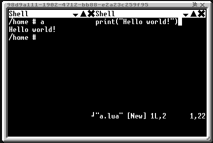
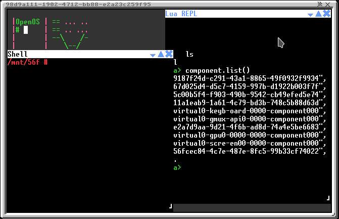
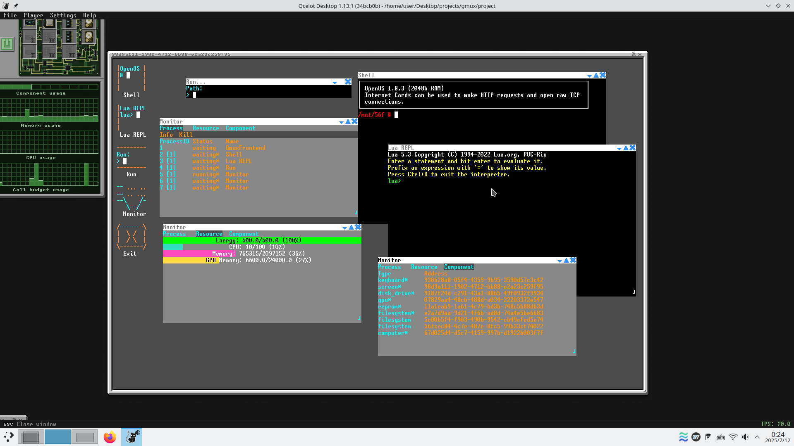

## 文档说明

**⚠️ 重要声明**

本README文档由AI自动生成，内容基于对项目代码的分析和理解。虽然我们努力确保信息的准确性，但实际功能和行为可能与文档描述存在差异。

**请以实际代码和运行结果为准。**

如有疑问或发现文档与实际不符，请：
1. 查看项目源代码
2. 实际运行测试
3. 提交Issue报告问题

---

**文档生成信息**
- 生成时间：2025年
- 生成方式：AI辅助生成
- 基于项目：Gmux 图形化多任务操作系统

# Gmux - 图形化多任务操作系统

Gmux 是一个基于 OpenComputers 的图形化多任务操作系统，提供现代化的桌面环境和强大的多进程管理功能。

## 安装说明

### Oppm

- `oppm register aawwaaa/OpenPrograms`
- `oppm install gmux`
- Enjoy!

### 手动

- 下载 `main` 分支，解压 `gmux/`。
- 将 `bin/`、`lib/`、`share/` 复制到 `/usr`。
- Enjoy!

## 功能特性

### 🖥️ 图形化界面
- 现代化的桌面环境
- 窗口管理系统
- 多任务支持
- 实时图形渲染

### 📸 系统截图


*GPU组件测试界面 - 基础功能演示*


*GPU组件测试界面 - 高级功能演示*


*GPU组件测试界面 - 完整功能演示*

### 🔧 系统管理
- 多进程管理系统
- 虚拟组件抽象层
- 事件驱动架构
- 资源监控

### 📱 内置应用程序
- **Shell** - 命令行终端
- **Lua REPL** - Lua 交互式解释器
- **Monitor** - 系统资源监控器
- **Run** - 程序运行器
- **Exit** - 系统退出工具

### 🛠️ 开发支持
- 模块化应用架构
- API 接口支持
- 错误处理机制
- 调试工具

## 系统要求

- OpenComputers 模组
- 支持图形显示的计算机
- GPU 组件
- 键盘组件
- 屏幕组件

## 安装说明

1. 确保你的 OpenComputers 环境已正确配置
2. 将项目文件复制到计算机中
3. 运行主程序：
   ```bash
   gmux
   ```

## 使用方法

### 启动系统
```bash
gmux
```

### 运行应用程序
```lua
-- 使用 start 命令运行程序
start /path/to/your/program.lua
```

### 系统监控
- 使用 Monitor 应用查看系统资源使用情况
- 监控 CPU 使用率、内存占用、能源状态
- 管理运行中的进程

### 开发应用
```lua
-- 创建新的图形应用程序
return {
    name = "My App",
    draw_icon = function(gpu, colors, x, y)
        -- 绘制应用图标
    end,
    graphics_process = {
        width = 80, height = 25,
        main_path = "/path/to/main.lua",
        name = "My App"
    }
}
```

## 项目结构

```
gmux/
├── backend/           # 后端核心系统
│   ├── core.lua      # 核心引擎
│   ├── process.lua   # 进程管理
│   ├── config.lua    # 配置文件
│   ├── patch.lua     # 系统补丁
│   ├── patchs/       # 补丁文件
│   └── virtual_components/  # 虚拟组件
├── frontend/         # 前端界面
│   ├── main.lua      # 主界面
│   ├── desktop.lua   # 桌面环境
│   ├── windows.lua   # 窗口管理
│   ├── graphics.lua  # 图形渲染
│   ├── api.lua       # API 接口
│   └── apps/         # 内置应用
├── bin/              # 系统工具
│   └── start.lua     # 程序启动器
└── gmux.lua          # 主入口文件
```

## 技术架构

### 后端系统
- **进程管理**: 支持多进程并发执行
- **虚拟组件**: 抽象硬件组件接口
- **事件处理**: 统一的事件驱动架构
- **资源管理**: 系统资源分配和监控

### 前端系统
- **图形渲染**: 实时图形界面更新
- **窗口管理**: 多窗口支持和布局
- **用户交互**: 键盘和鼠标事件处理
- **桌面环境**: 应用程序启动和管理

### 应用程序框架
- **模块化设计**: 易于扩展的应用程序架构
- **API 接口**: 标准化的系统调用接口
- **错误处理**: 完善的异常处理机制

## 开发指南

### 创建新应用
1. 在 `frontend/apps/` 目录下创建应用文件
2. 实现应用接口（name, draw_icon, graphics_process）
3. 在 `frontend/main.lua` 中注册应用

### 系统 API
- `component.gmuxapi` - 主要 API 接口
- `api.create_window()` - 创建窗口
- `api.create_graphics_process()` - 创建图形进程
- `api.get_processes()` - 获取进程列表

## 许可证

本项目采用 MIT 许可证 - 详见 [LICENSE](LICENSE) 文件

## 贡献

欢迎提交 Issue 和 Pull Request 来改进这个项目！

## 作者

Copyright © 2025 aawwaaa

---

*Gmux - 为 OpenComputers 带来现代化的图形化体验*

---